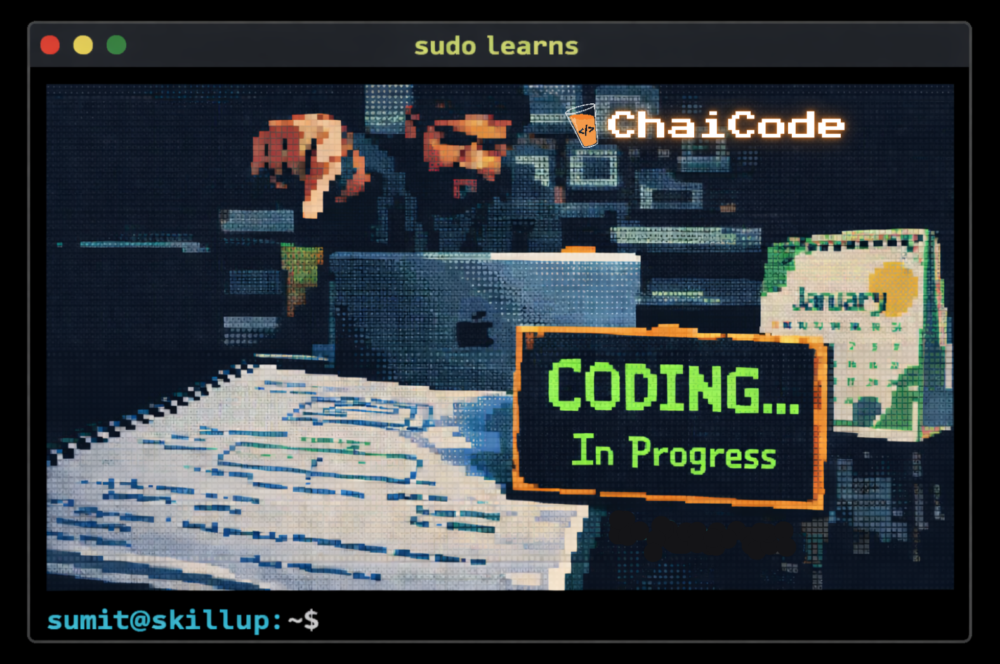

# 🌱 Cohort Journey
<p align="center">
    
</p>


> *This repo is me learning in public.*
> Just me getting better , writing , creating , breaking and showing up every damn time.

---

##  Why this repository exists

I’m part of a WebDev cohort by @ChaiCodeTeam , and instead of letting everything disappear into notebooks, and forgotten folders, I decided to **document everything in one place**.

This repository is:

* my **notes**
* my **assignments**
* my **practice**
* my **projects**
* and my **thinking process**

If I ever look back and ask *“did I really put in the work?”* .. the answer will be here.

---

## Current Structure

```
.
├── assignments
├── docs
│   ├── blogs/
│   ├── diagrams/
│   └── notes/
├── practice/
├── projects/
├── README.md
└── LISCENSE

```

### What goes where (lil explanation)

* **docs/**

  * **blogs/** → long-form explanations in my own words
    If I can explain it here, I understand it.
  * **notes/** → raw learning notes, shortcuts, observations
  * **diagrams/** → visuals that make concepts click

* **assignments/**
  Everything submitted as part of the cohort —> problems, solutions, approaches.

* **practice/**
  Reps. Experiments. Trial & error.
  This is where I *actually* improve.. my own learnings implementation

* **projects/**
  Anything that’s more than a small exercise.

---

# How I’m using this repo

* Writing **even when things feel unclear**
* Updating notes as my understanding improves
* Treating confusion as part of the process, not a demotivation

This is not a over view repo like insta highlights.. 
It’s a constantly upgrading **work log**.

---

## A small personal rule

> If I learn something today and don’t write it down,
> I didn’t really learn it.

This repo keeps me honest.

---

## Status

 **Coding in progress**
This repository will keep evolving as the cohort goes on.

Things may be messy.
but that's okay.. 

---

## If you’re reading this

If you’re:

* a recruiter → this shows how I think
* a fellow learner → feel free to explore or borrow ideas
* future me → don’t forget how much effort this took

---

## License

MIT License : feel free to learn from it, reuse it, and build on it.
Just give credit where it’s due.
